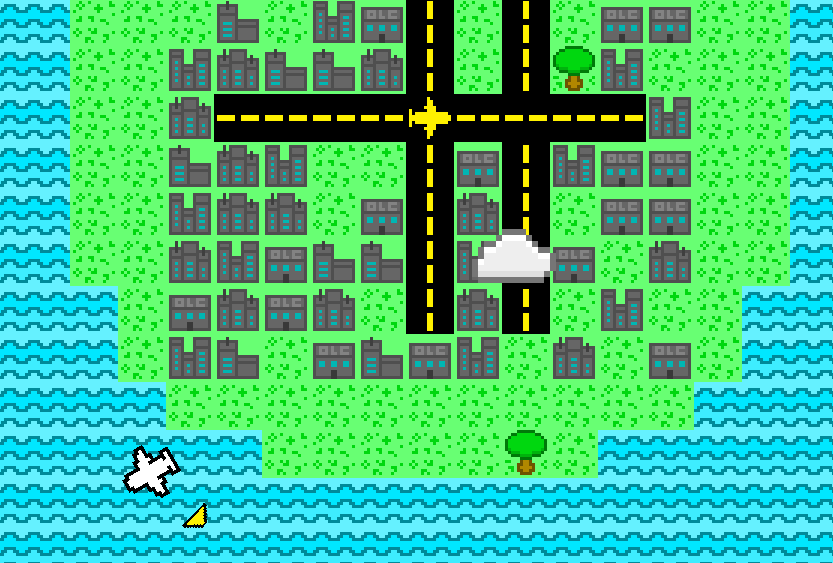
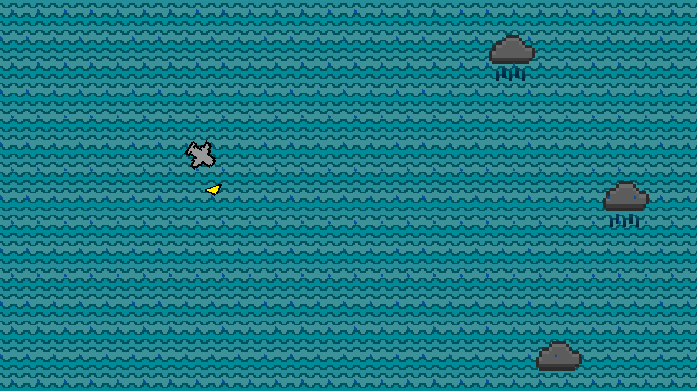
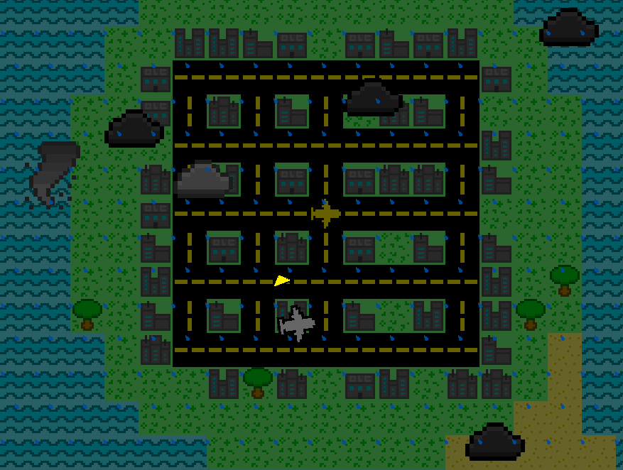

# Turbulence Ahead!

## About

This is a small and simple game that I made for the 2022 One Lone Coder code
jam. It didn't do particularly well in the ratings (not that many people
ended up playing it) but I'm fairly happy with how it turned out (I really
like how the art turned out) and I'm fairly proud of it. I am uploading the
source code now just to document my progress as a programmer and perhaps
give an opportunity for more people to see it in the future.

## How to Play

### Controls
Left/Right Arrow keys to turn
Up Arrow key to speed up, Down Arrow key to slow down

### Game Mechanics
In this game, you control a small plane and you have to arrive at 6 cities to
win. However, over time, the weather gets worse and you have to control the
plane while fighting wind and avoiding any extreme weather that comes in your
path. If you go to fast your plane will run out of fuel and crash. However,
if you move too slow your final time will not be good and you might not be
able to fight the wind. Good luck and have fun!

## Links
Download: https://nullptr-error.itch.io/turbulence

YouTube Video: https://www.youtube.com/watch?v=l7hpFP6Go60  

## Screenshots

